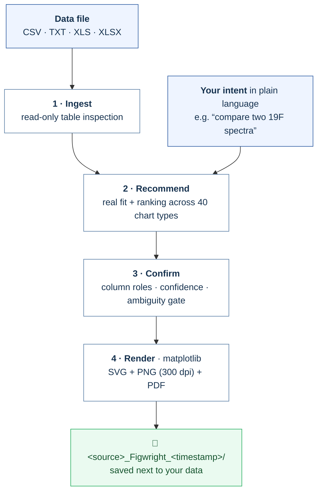

<div align="center">

# Figwright

**图匠 · Drop in a table. Walk away with a publication-grade, watermark-free figure.**

[](LICENSE)
[](#)
[](#)
[](#)
[](#)
[](#)
[](#8-可选-origin-备份后端实验性需自备正版-origin)

**一款完全本地运行的 AI 科研绘图引擎。**
丢进一张数据表，用一句话说清你想表达什么，Figwright 自动选图、自动映射列，
直接产出出版级、无水印、可二次编辑的矢量图。无需安装或购买 Origin，数据全程不出本机。

*A fully local, AI-guided scientific plotting engine: point it at a table, state your question in plain language, and get a publication-informed editable vector figure rendered with open-source matplotlib — no Origin license, no COM automation, no demo watermark.*

</div>

---

## Why Figwright

科研绘图的门槛从来不只是“画图”，而是**选对图、映射对列、调对版式**。Figwright 把这条链路自动化，
同时把科学判断权留给你：

- **从“会用软件”到“会提问题”** — 内置选图引擎会对 **40 类**科学/统计图种做**真实试拟合**，再按你的
  自然语言目的排序推荐，而不是靠关键词套模板。
- **不确定，就停下来问** — 列角色有歧义、候选图同分、映射置信度不足时，Figwright 会显式停下等你确认，
  绝不“硬画”一张会误导人的图。
- **矢量优先，出版取向** — 白底、Arial、克制式配色与层级；默认产出可编辑 **SVG** 与 300 dpi **PNG/PDF**。
- **本地优先，零上传** — 读表、试算、渲染全部在你自己的 Python 环境离线完成，适合未发表数据与受合规约束的资料。
- **无需 Origin，也不与正版冲突** — 主线由开源 matplotlib 渲染，从源头没有 demo 水印；另提供一个
  **默认关闭、独立环境、正版门控**的可选 Origin 工程后端（见第八节）。

## How it works



每一次出图都带 `figwright_report.json`：图种、列映射、置信度、数据 SHA-256、画布尺寸全程可溯源。

---

## 1. Install

环境要求：**64 位 Windows 10/11**、**64 位 Python 3.11 或 3.12**（安装时勾选 *Add python.exe to PATH*）。
锁定依赖会装进产品自己的 `.venv`，不污染系统环境。

```powershell
git clone https://github.com/lzlin3459-hash/Figwright.git
cd Figwright
setup.cmd            # 一键：建 .venv → 装锁定依赖 → doctor 自检 →（检测到豆包则）注册本地 Skill
```

看到 `=== Figwright 安装完成 ===` 即成功。仅安装步骤需要联网，之后出图全程离线。

> 重建环境：`setup.cmd --clean`；只补注册豆包 Skill：`setup.cmd install-skill`。

## 2. Use it

### A. 在豆包里用自然语言（推荐）

安装完成后直接说，例如：

- “用 Figwright 把这个 CSV 画成图，我想对比两组的差异”
- “帮我看这张 XRD 数据的物相”
- “把这份核磁数据画成谱图”

豆包会调用 Figwright：识别数据 → 推荐最合适的 1–3 个图种并与你确认 → 一键出图。

### B. 命令行

在产品目录下：

```bat
figwright.cmd doctor
figwright.cmd catalog
figwright.cmd recommend "D:\data\nmr.csv" --intent "对比两张19F核磁谱"
figwright.cmd draw      "D:\data\nmr.csv" --intent "对比两张19F核磁谱"
figwright.cmd draw      "D:\data\xrd.csv" --template xrd
figwright.cmd draw      "D:\data\y.csv" --strict
```

- 不给 `--template` 时按数据 + `--intent` 自动选图；`--strict` 在映射不确定时停下（退出码 3）。
- 默认写到**源文件旁边**的 `<文件名>_Figwright_<时间戳>` 文件夹；`--output-dir` 仅在你明确要换位置时使用。
- 可调 `--formats png,svg,pdf` 与 `--dpi 300`。

## 3. Outputs

| File | 说明 |
| --- | --- |
| `result.png` | 300 dpi 位图，论文/汇报直接用 |
| `result.svg` | 矢量图，文字/配色可在 Inkscape、Illustrator、PowerPoint 中编辑（svg.fonttype=none） |
| `result.pdf` | 矢量 PDF |
| `<源文件名>` | 源数据副本，便于溯源 |
| `figwright_report.json` | 图种、列映射、置信度、数据哈希、画布尺寸等留痕 |

覆盖 **40** 类图种：NMR、XRD/Rietveld、XPS、FTIR、UV-Vis、DSC、EIS、LSV、CV、PL、XAS，
柱状/条形/堆积/百分比柱、误差折线/趋势、散点/气泡、直方/箱线/小提琴/雨云、饼图、热图、
桑基、雷达、环形网络、森林图、Bland–Altman、ROC/校准/决策曲线、混淆矩阵、SHAP、3D 轨迹等。

## 4. Project layout

```text
Figwright/
+- setup.cmd               一键安装入口（用户双击）
+- figwright.cmd           命令行启动器（用产品内 .venv）
+- requirements.txt        锁定版本的开源依赖
+- LICENSE / NOTICE        Apache-2.0 许可证与第三方署名
+- scripts/setup.py        安装引导（建 venv、装依赖、doctor、注册 Skill）
+- figwright/              应用层（env / selector / render / origin_link / cli）
+- engine/                 默认 matplotlib 渲染引擎（源自 editaplot 的 Origin 无关核心）
|  +- src/origin_sciplot/  数据分析/选型/配色/matplotlib 渲染（无 Origin/GUI 模块）
|  +- templates/           40 个可直接渲染的图种规格（manifest/schema/契约）
+- origin_runtime/         【可选】vendored 的 Origin 备份后端源码（实验性，默认不装/不加载）
+- skill/figwright/        豆包本地 Skill 模板（安装时复制进豆包目录）
```

> 需要 `.opju` 备份方案（自备正版 Origin）才装可选后端：`setup.cmd install-origin`；
> 普通用户无需理会 `origin_runtime/`，主程序安装与出图完全不依赖它。

## 5. Science & data contract

- 源文件**只读**：绝不改写、补全缺失列或编造测量值。
- 只做“展示”，不擅自平滑、拟合、归一化、去噪、峰指认、统计检验或剔除离群点——除非你明确要求且该图种支持。
- 自动选图是**建议**而非定论；能渲染但会误导的图会被明确拒绝。
- 专业谱图遵循各自坐标惯例（如 NMR 化学位移由大到小、XPS 结合能由高到低）。
- 定位为 **publication-informed（出版取向）**：不宣称“Nature 同款”或“期刊保证录用”。

## 6. Licensing & compliance

- **Apache-2.0**：可自由使用、修改、分发（含商用），但须随包保留 `LICENSE` 与 `NOTICE`，并在改动文件上注明变更。
- **无水印的来源是渲染方式，而非破解**：Figwright 的图由开源 matplotlib 直接生成；它**不破解、不补丁、不绕过**
  任何 Origin/OriginPro 授权或 demo 水印，也不捆绑、不安装任何 OriginLab 软件、模板、Logo 或试用包。
- Figwright 与 **OriginLab Corporation 无任何关联、背书或赞助关系**；Origin / OriginPro 是 OriginLab 的商标与商业产品。
- 分析核心基于同样以 Apache-2.0 发布的 **EditaPlot** 项目的 Origin 无关部分，详见 `NOTICE` 中的署名与修改声明。
- 第三方依赖（numpy / pandas / matplotlib / openpyxl / xlrd / Pillow / PyYAML / jsonschema）均为 OSI 认可的开源许可。

## 7. FAQ

**“无需 Origin”是什么意思？** 图不是用 Origin 画的，而是开源 matplotlib 在自带 Python 里渲染，
所以你不必购买或安装 Origin，也不会出现学习版那种满幅 demo 水印。

**和正版 Origin 工作流差在哪？** Figwright 交付可编辑 **SVG + PNG/PDF**（在 Inkscape/Illustrator/PPT 里改）；
正版 Origin 工作流交付 **`.opju`**（在 Origin 内按图层编辑、做峰拟合并对接课题组流程）。

**我就是需要 `.opju` 怎么办？** 那需要一份**正版激活**的 Origin 授权。请使用下面的可选后端；
任何工具都无法在没有正版 Origin 时合法产出可用 `.opju`，Figwright 不会、也不能通过破解满足它。

## 8. 可选 Origin 备份后端（实验性，需自备正版 Origin）

面向**少数必须拿到 `.opju`、且本机已装正版激活 Origin/OriginPro 2021+** 的用户。它与主线完全隔离：
默认安装不含它，主 `.venv` 也永远不会加载 originpro。

```bat
setup.cmd install-origin        :: 单独安装可选后端（另建独立 .venv-origin，不影响主环境）
setup.cmd --with-origin         :: 装主程序时一并安装
figwright.cmd origin-smoke      :: 预检：会起一个专用隐藏 Origin 实例，约 1–3 分钟
```

自检 `status` 是唯一判据：

- **`passed`** —— 能连接、能导出，且**真正存出了非空 `result.opju`**（正版环境），可继续：

  ```bat
  figwright.cmd draw "D:\data\nmr.csv" --template nmr --backend origin --confirm-licensed-origin
  ```

- **`degraded`** —— 学习/试用等工程保存受限环境：能连、能导 PNG/PDF/TIF，但**存不了 `.opju`**。
  Figwright 会直接拒绝并引导你回到无水印的 matplotlib 路线，**不去水印、不产出带水印成果**。

退出码：`5` = 未做正版声明；`6` = 自检判定为受限环境并已拦截；`4` = Origin 技术错误。

> 该后端当前为 **experimental**：开发者仅有学习版测试机，已验证“独立环境 / 连接 / 建图 / 导出 /
> degraded 拦截”全链路，而“正版无水印 `.opju`”需在真实正版机由用户自检 `passed` 后才成立，
> 届时方可转为 stable。

## 9. Roadmap

- 在真实正版 Origin 机器上端到端验证后，将可选后端由 experimental 转为 stable。
- 更多图种与中英双语界面、图形化安装器。

---

<div align="center">

**Built on the shoulders of open science.**
Figwright stands on the Apache-2.0 analytical core of [EditaPlot](https://github.com/hang-jin/editaplot) and the
open-source scientific Python stack. Independent project — not affiliated with OriginLab.

</div>
